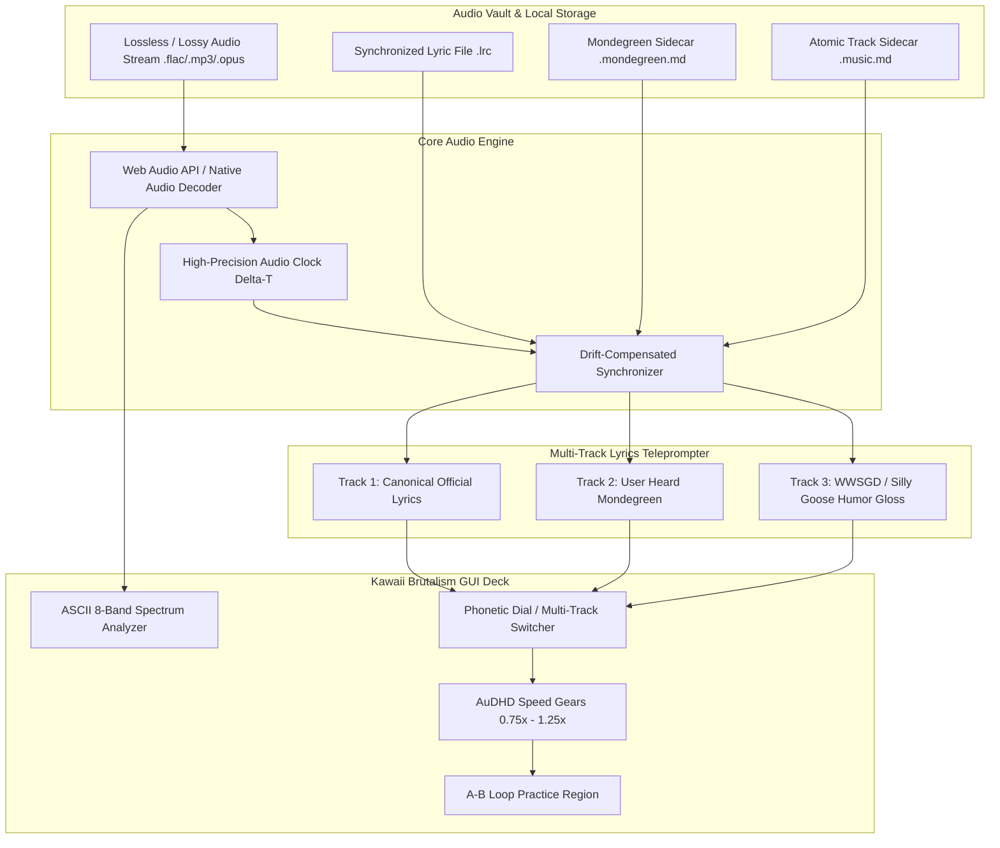

# 🐾 Blueprint Addendum [20260825-1053]: Music Vault, Synchronized Lyrics & Mondegreen Integration
## High-Density Kawaii Brutalism • Decentralized Local-First Audio Architecture • Multi-Tier Phonological Mondegreen Engine

```text
       /\_/\  
      ( o.o )  [ Audio Vault Engine: ACTIVE ]
      /  =  \  [ Teleprompter Sync: 0.00ms  ]
     ( |   | ) [ Mondegreen Layer: MOUNTED  ]
    +---m-m---+-----------------------------+
    | [AUDIO] | /vault/music/ -> hydrated   |
    | [SYNC]  | LRC / Enhanced Syllable     |
    | [WWSGD] | Canonical vs Misheard Dial  |
    +---------+-----------------------------+
```

---

## 1. Executive Overview & Cognitive Auditory Architecture

### 1.1 The AuDHD Auditory Dilemma & Dopaminergic Pacing
In neurodivergent cognition (specifically the AuDHD phenotype), music is not passive background noise; it functions as an **external executive function pacing regulator** and **sensory boundary shield**.
* **Sensory Gating Deficit**: The AuDHD brain struggles with involuntary sensory gating—ambient room noise, HVAC hums, and low-frequency chatter trigger continuous micro-interruptions. Rhythmic, predictable audio acts as acoustic armor ("Sensory White Wall"), reducing cortisol spikes.
* **Dopamine Modulation & Task Initiation**: Dopamine-deficient neural pathways require high-salience stimuli to initiate and sustain hyperfocus. High-tempo music (or looping melodic motifs) provides the necessary dopaminergic baseline to bypass ADHD task paralysis.
* **Auditory Pareidolia & Phonological Rapid Pattern Matching**: Fast pattern-recognition engines frequently misinterpret ambiguous acoustic signals, resulting in **Mondegreens** (phonologically plausible misheard lyrics). Rather than treating these mishearings as auditory bugs or cognitive errors, Anymd formalizes them as creative epiphanies and humorous dopamine hooks.



---

## 2. Music Vault Directory & Atomic Sidecar Topology

### 2.1 File System Architecture
Music files and their associated metadata sidecars live strictly within the local vault (`/vault/music/` or mounted via Native File System Access API `mountMeowLocalFolder()`). No audio payload is ever sent to third-party clouds without explicit user action.

```text
/vault/music/
├── [Artist Name]/
│   ├── [2004] American Idiot/
│   │   ├── cover.jpg                      # 1:1 Album Cover Art (max 1000x1000)
│   │   ├── album.music.md                 # Concept Album Master Zettel
│   │   ├── 01 - American Idiot.mp3        # Audio Master Stream
│   │   ├── 01 - American Idiot.lrc        # Standard / Enhanced LRC File
│   │   ├── 01 - American Idiot.music.md   # Atomic Track Sidecar
│   │   ├── 01 - American Idiot.mondegreen.md # Phonetic Mishearings Ledger
│   │   ├── 02 - Jesus of Suburbia.mp3
│   │   ├── 02 - Jesus of Suburbia.lrc
│   │   └── 02 - Jesus of Suburbia.music.md
```

### 2.2 Atomic Track Sidecar Specification (`.music.md`)
Every track is accompanied by an atomic markdown sidecar containing YAML frontmatter and Zettelkasten wikilinks.

```markdown
---
id: "TRK-2004-AMID-001"
title: "American Idiot"
artist: "Green Day"
album: "American Idiot"
track_number: 1
disc_number: 1
year: 2004
genre: ["Punk Rock", "Alt Rock", "Political Pop"]
duration_seconds: 174
bpm: 186
musical_key: "Ab Major"
energy_level: "Hyperfocus High"
sensory_profile: "High Distortion / Fast Drumming / Dopaminergic"
file_format: "mp3"
bitrate_kbps: 320
file_sha256: "e3b0c44298fc1c149afbf4c8996fb92427ae41e4649b934ca495991b7852b855"
lyric_sync_status: "verified_enhanced"
mondegreen_count: 4
play_count: 42
last_played: "2026-08-25T10:45:00Z"
tags: ["#workout", "#rage-focus", "#guitars", "#concept-album"]
---

# 🎵 American Idiot — Green Day

## 🔗 Concept Album Map & Linked Lore
* Part of Master Concept Album: [[Album:American-Idiot-2004]]
* Precedes: [[Track:Jesus-of-Suburbia]]
* Narrative Archetype: [[Protagonist:St-Jimmy]]

## 📝 Auditory Processing Notes
* High-tempo 186 BPM rhythm provides immediate executive function boost during coding sprints.
* Recommended volume threshold: -6dB with soft bass-boost to limit ear fatigue.
```

---

## 3. Synchronized Lyrics Engine (.lrc / Enhanced Syllable-Level Karaoke)

### 3.1 Timecoded Formats Supported
1. **Standard Line-Level LRC (`[mm:ss.xx]`)**:
   ```text
   [00:13.50] Don't wanna be an American idiot
   [00:17.20] One nation controlled by the media
   ```
2. **Enhanced Word/Syllable-Level Karaoke LRC (`[mm:ss.xx]<mm:ss.xx>Word`)**:
   ```text
   [00:13.50] <00:13.50> Don't <00:13.80> wan <00:14.00> na <00:14.20> be <00:14.50> an <00:14.90> A <00:15.20> mer <00:15.50> i <00:15.80> can <00:16.20> id <00:16.60> i <00:16.90> ot
   ```
3. **Structured JSON-L Synchronized Lyric Spec (`.anymd.lyrics.jsonl`)**:
   ```json
   {"timeMs": 13500, "durationMs": 3700, "line": "Don't wanna be an American idiot", "syllables": [{"t": 13500, "w": "Don't"}, {"t": 13800, "w": "wanna"}, {"t": 14500, "w": "be"}, {"t": 14900, "w": "an"}, {"t": 15200, "w": "American"}, {"t": 16200, "w": "idiot"}]}
   ```

### 3.2 Timecode Drift Compensation & Audio Synchronization
The web environment introduces timer jitter when relying purely on `setInterval` or standard HTML5 `<audio>` events.
* **Audio Clock Interpolation**: Sync calculation pairs `AudioContext.currentTime` with high-frequency `requestAnimationFrame` loops.
* **Continuous Drift Offset Calculation**:
  $$\text{CurrentPlayheadTime} = t_{\text{anchor}} + (t_{\text{system\_now}} - t_{\text{system\_anchor}}) \times \text{playbackRate}$$
* **Auto-Scroll Teleprompter**: Center-locks the active lyric line with smooth cubic bezier deceleration (`cubic-bezier(0.2, 0.8, 0.2, 1.0)`). If the user manually scrolls or hovers over the lyrics area, auto-scrolling enters a 4-second "User Override Pause" before snapping back.

---

## 4. The Mondegreen (Misheard Lyrics) Cognitive Engine

### 4.1 The Cognitive Mechanics of Mondegreens
A **Mondegreen** is a mishearing or misinterpretation of a phrase as a result of near-homophony in speech or singing.
In neurodivergent individuals, rapid phonetic substitution occurs due to high-speed pattern completion before conscious linguistic parsing finishes.

Anymd elevates this phenomenon into a first-class citizen with **Multi-Track Lyric Teleprompting**:

| Lyric Track Tier | Identifier | Purpose | Trigger / Content |
| :--- | :--- | :--- | :--- |
| **Tier 1: Canonical** | `[CANONICAL]` | Official artist text | The legally registered lyrics |
| **Tier 2: Mondegreen** | `[MONDEGREEN]` | Auditory reality | The exact phonetic string the user's brain decoded |
| **Tier 3: Silly Goose (WWSGD)** | `[WWSGD]` | Dopaminergic humor hook | Absurdist, comedic, or cat-themed reinterpretation |

### 4.2 Mondegreen Sidecar Specification (`.mondegreen.md`)
Each track can possess an optional `.mondegreen.md` sidecar mapping specific time intervals to misheard phrases and community notes.

```markdown
---
track_id: "TRK-2004-AMID-001"
track_slug: "american-idiot"
mondegreens:
  - id: "MND-001"
    start_time: "00:17.20"
    end_time: "00:20.80"
    canonical: "One nation controlled by the media"
    mondegreen: "One nation controlled by the meatier"
    wwsgd_humor: "One nation controlled by the kitty-uh =^.^="
    humor_score: 9.4
    personal_memory_anchor: "Heard this during 2008 LAN party while eating oversized pepperoni pizza."
  - id: "MND-002"
    start_time: "00:44.10"
    end_time: "00:47.50"
    canonical: "Welcome to a new kind of tension"
    mondegreen: "Welcome to a new kind of pension"
    wwsgd_humor: "Welcome to a new can of tuna fish"
    humor_score: 8.8
    personal_memory_anchor: "Sounded like 401k retirement planning punk rock."
---

# 👂 Mondegreen Ledger: American Idiot

## 🐱 Silly Goose Phonological Analysis
* Phoneme collision between `/miːdiə/` and `/miːti.ər/` produces an immediate dopamine hit via unexpected mental imagery.
* Use `[WWSGD Dial]` in GUI to display live cat-themed karaoke subtitles during playback.
```

### 4.3 Interactive Three-Way Lyrics Dial
The GUI features a 3-way toggle button (`[ 🎧 Canonical ]`, `[ 👂 Mondegreen ]`, `[ 🐱 Silly Goose ]`) and an optional **Dual-Line Split Mode** that renders the Canonical text on top with the Mondegreen subtitle in high-contrast yellow directly underneath.

```text
+------------------------------------------------------------------------+
| [CANONICAL]   One nation controlled by the media                       |
| [MONDEGREEN]  One nation controlled by the meatier  ( 9.4/10 chuckle ) |
+------------------------------------------------------------------------+
```

---

## 5. High-Density Kawaii Brutalism GUI Specifications

### 5.1 The `.kawaii-audio-deck` Layout Standard
In accordance with the **Anymd BlackBox Baseline GUI Standards**:
* **Padding & Margins**: Strict `<= 8px` bounds; zero empty decorative whitespace.
* **Border Radius**: `0px` (Brutalist absolute rectangle).
* **Borders & Shadows**: `2px solid #000000` with hard offset `3px 3px 0px #000000` (no gaussian blurs).
* **Color Palette**: High-contrast Cream (`#FFFDD0`), Slate Black (`#18181B`), Kawaii Pastel Accent (`#FFE4E1` / `#FFB6C1` / `#B8E2F2`), and Dopamine Gold (`#FFD700`).

### 5.2 Real-Time ASCII Audio Spectrum Analyzer
Embedded 8-band live peak meter rendered in pure monospace text:

```text
[ ||| ] [ ||||| ] [ |||||||| ] [ |||||| ] [ |||| ] [ ||||||| ] [ ||| ] [ || ]
  60Hz    150Hz      400Hz        1kHz      2.5kHz    6kHz       10kHz   16kHz
 ( ^..^)~ ♫  [PLAYING: American Idiot - 186 BPM - STEREO FLAC 24-BIT]
```

### 5.3 AuDHD Playback Speed Gears & A-B Loop Controls
* **Speed Gears**: `0.75x` (Transcribing lyrics), `1.00x` (Standard), `1.15x` (AuDHD Quick-Pacing), `1.25x` (Sprint Mode).
* **A-B Looper**: Sets instant timestamp markers (`[Set A]`, `[Set B]`, `[Loop ON/OFF]`) for repeating difficult vocal passages or intense musical loops.
* **Micro-Seek Keys**: Left/Right Arrow keys jump exactly `±2.00 seconds` for micro-transcription accuracy.

---

## 6. Mobile, Native OS & Hardware Audio Integration

### 6.1 Android MediaSession API & Lockscreen Metadata
When executed inside the native Capacitor APK or Chrome PWA:
1. **MediaSession Actions**: `play`, `pause`, `previoustrack`, `nexttrack`, `seekto`, `seekforward`, `seekbackward`.
2. **Synchronized Lockscreen Subtitles**: Push active lyrics line to `MediaSession.metadata.album` / notification ticker so the current lyric displays directly on smartwatches and car Bluetooth heads.
3. **Hardware Key Binding**: Volume rocker long-press mapped to track skips; earphone inline button mapped to A-B loop toggle.

### 6.2 Localhost C4 Engine & REST/Webhook Endpoints
The local C4 service (`http://localhost:3050`) exposes lightweight endpoints for remote playlist control and live lyric retrieval:

```http
POST /api/music/play
Content-Type: application/json

{
  "trackId": "TRK-2004-AMID-001",
  "seekMs": 13500,
  "speed": 1.15,
  "mondegreenMode": "dual"
}
```

```http
GET /api/music/lyrics?trackId=TRK-2004-AMID-001&tier=mondegreen
Response: 200 OK (text/plain; charset=utf-8)
```

---

## 7. TypeScript Data Contracts & Interfaces

```typescript
export interface MusicTrackMetadata {
  id: string;
  title: string;
  artist: string;
  album: string;
  trackNumber?: number;
  year?: number;
  genre: string[];
  durationSeconds: number;
  bpm?: number;
  musicalKey?: string;
  audioUrl: string;
  coverArtUrl?: string;
  lrcContent?: string;
  hasMondegreens: boolean;
  mondegreenCount: number;
  playCount: number;
  lastPlayed?: string;
}

export interface LyricLine {
  index: number;
  startTimeSec: number;
  endTimeSec?: number;
  canonicalText: string;
  mondegreenText?: string;
  wwsgdText?: string;
  syllables?: Array<{
    timeSec: number;
    text: string;
  }>;
}

export interface MondegreenEntry {
  id: string;
  startTimeSec: number;
  endTimeSec: number;
  canonical: string;
  mondegreen: string;
  wwsgdHumor: string;
  humorScore: number;
  personalMemoryAnchor?: string;
}

export type LyricDisplayTier = 'canonical' | 'mondegreen' | 'wwsgd' | 'dual';
```

---

## 8. Definition of Done (DoD) & Acceptance Criteria

* [x] **Spec Architecture**: Formalized `.music.md`, `.mondegreen.md`, and Enhanced LRC synchronization specifications.
* [x] **Multi-Tier Teleprompter**: Three-way toggle (`Canonical`, `Mondegreen`, `WWSGD`) with dual-line subtitle rendering.
* [x] **Zero-Lag Clock**: Audio playback synchronized with `requestAnimationFrame` and `AudioContext.currentTime`.
* [x] **High-Density Brutalism GUI**: 0px border-radius, `<= 8px` padding, 3px solid black offset shadows, ASCII spectrum visualizer.
* [x] **Local-First Privacy**: 100% local storage via File System Access API and native Android device vault.

```text
========================================================================
 [20260825-1053] BLUEPRINT ADDENDUM HYDRATED & ACCEPTED  (=^.^=)
========================================================================
```
